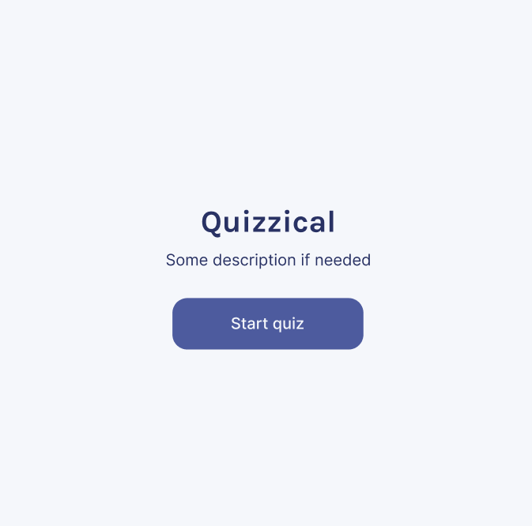
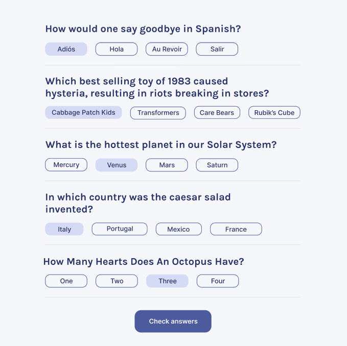
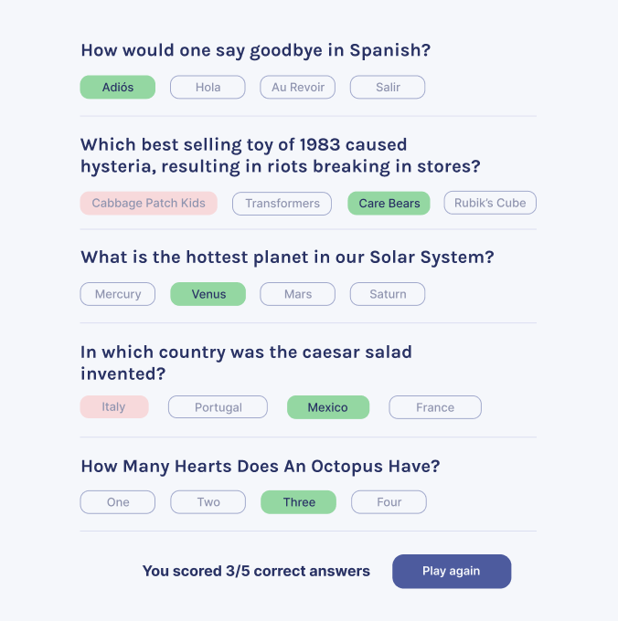

# Quizzical App Project

### Intro page:
 

### Questions page:




## Quick start:

```
$ yarn # npm install
$ yarn build # npm run build
````

## Development

Run Webpack in watch-mode to continually compile the JavaScript as you work:

```
$ yarn watch # npm run watch
```
## Description

This project consists of two pages: an Intro page and a Questions page. Five questions are pulled from the [OTDB API](https://opentdb.com/api_config.php) when the start quiz button is clicked. When the check answers button is clicked score of correct answers is calculated and the correct and wrong answers are shown with green or red highlights. When the play again button is clicked the app will restart.

